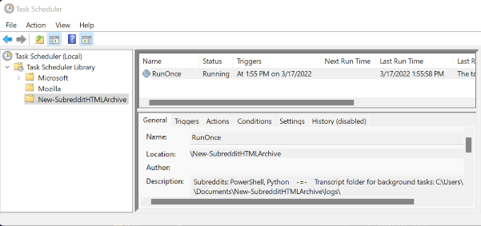
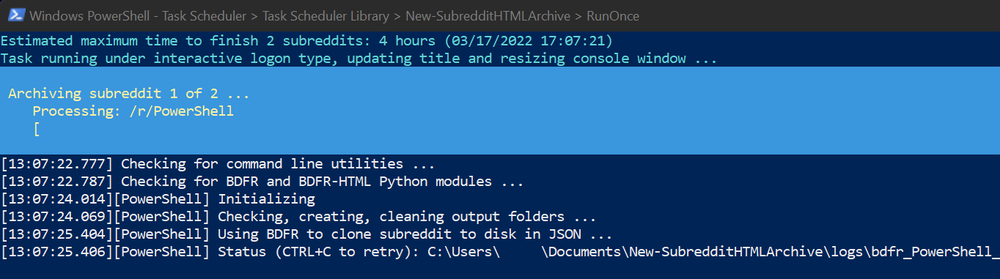
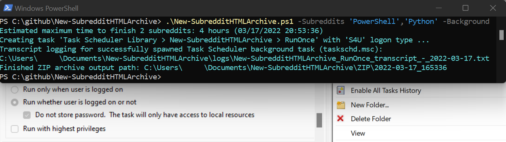

## Usage  
1) PS> Invoke-WebRequest -URI https://raw.githubusercontent.com/mbarr564/New-SubredditHTMLArchive/main/New-SubredditHTMLArchive.ps1 -OutFile .\New-SubredditHTMLArchive.ps1  
2) PS> .\New-SubredditHTMLArchive.ps1 -Subreddits 'PowerShell','Python' -InstallPackages  
  
## Screenshots  
The script will run and make itself into a task called 'RunOnce' in Task Scheduler (taskschd.msc):  
  

  
Then seconds later, that created task will run, and by default will pop up an interactive console:  
  

  
If you run the script with the -Background switch parameter supplied, you will instead see the path to the transcript log, and the future finished ZIP file directory:  
  

  
## Added features since initial release  
- Missing dependency package installation with the new -InstallPackages parameter.
    1. Outputs list of installed Python modules, and does prerequisite checks for winget.
- Support for arrays of subreddit names with the new -Subreddits parameter.
    1. Generates master index.html linking to all archived subreddit index files.
    2. Compresses master index and all HTML archive folders into a portable ZIP file.
- Assisted GitHub authentication step, progress bar, and subreddit input validation.
- Better BDFR-HTML module installation with error/standard output logging.
- BDFR clone operations are now retried up to 20 times, with cumulative sleep.
- Added logs folder and cleaned all folder management code.. all logs now retained.
- Added CTRL+C handling: once restarts clone, twice exits script. Added loop hang detection.
- Script spawns itself as a scheduled task, enabling S4U background runs, and rerun scheduling.
- Added -Background parameter to set spawned task LogonType to S4U (with no stored password).