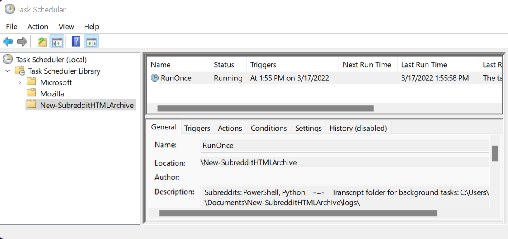

If you don't usually run scripts, you'll need to run [PowerShell](https://docs.microsoft.com/en-us/learn/modules/introduction-to-powershell/): WinKey+R, type **powershell**, hit Enter.  
In the taskbar at screen bottom, right-click the blue icon with >_ on it, choose 'Run as Administrator'.  
Then at the console prompt (PS C:\Users\username>), type **Set-ExecutionPolicy AllSigned**, hit Enter.  
Then type Y, and hit Enter to confirm. You can now close the second (Administrator titled) window.  
The above allows this script to run, and requires all scripts that you run to be [code signed](https://blog.devgenius.io/powershell-code-signing-fc6086aeb61e?gi=8e073d4477a7),  
which provides content validation, and is the most restrictive PowerShell execution policy available.  
  
Then pick either GitHub or the PS Gallery option below to copy or install from.  
Both do the same thing, and you can copy/paste from this README into PowerShell.  
  
The suggested subreddit 'TestSubredditA' is a real subreddit name that takes just seconds to archive, and should be used as the default when installing packages on the first script run. The script is then expected to be supplied with a list of subreddit names, usually along with the -Background parameter, so you can lock your screen while the script continues to run.  
  
The Task Scheduler can be accessed by pressing the Windows key, typing the partial name 'Task S', then clicking 'Task Scheduler' when it pops up, or: press WinKey+R, type **taskschd.msc**, hit Enter.  
The new task can be renamed (via right-click > Export..., then Actions > Import Task...) and rescheduled to retrigger, archiving the same subreddits in the description monthly, etc. If the task name is unchanged, it will be overwritten when the script is run from the command line again, such as when you update the script. Note that if the running task is ended manually (right-click > End), you will need to manually kill the orphaned python process in Task Manager (CTRL+ALT+DEL), or simply reboot before retrying.  
  
The finished HTML archives and ZIP path are in the task description, and the end of the transcript.  
  
## GitHub: Example Usage  
1) PS> Invoke-WebRequest -URI https://raw.githubusercontent.com/mbarr564/New-SubredditHTMLArchive/main/New-SubredditHTMLArchive.ps1 -OutFile .\New-SubredditHTMLArchive.ps1  
2) PS> .\New-SubredditHTMLArchive.ps1 -Subreddit 'TestSubredditA' -InstallPackages  
3) PS> .\New-SubredditHTMLArchive.ps1 -Subreddits 'HackRF','GNURadio','SRAWeekend' -Background  
  
## PowerShell Gallery: Install  
1) PS> Install-Script -Name New-SubredditHTMLArchive  
2) PS> New-SubredditHTMLArchive.ps1 -Subreddit 'TestSubredditA' -InstallPackages  
3) PS> New-SubredditHTMLArchive.ps1 -Subreddits (Get-Content "$($env:USERPROFILE)\Desktop\subs.txt")  
Script path: ($env:path).Split(';') | % {if (Test-Path "$_\New-SubredditHTMLArchive.ps1"){start "$_"}}  
  
## PowerShell Gallery: Update  
1) PS> Update-Script -Name New-SubredditHTMLArchive  
2) PS> New-SubredditHTMLArchive.ps1 -Subreddits 'netsec','neuroscience','homelab','Onions' -Background  
  
## Comment Based Help (Script Header)  
See: [PSScriptInfo comment header breaking 'Get-Help .\Script.ps1 -Full'](https://stackoverflow.com/questions/71579241/powershell-gallery-psscriptinfo-comment-header-breaking-get-help-myscriptname/71579958#71579958)  
1) PS> Set-ExecutionPolicy -ExecutionPolicy Unrestricted -Scope Process  
2) PS> Get-Content .\New-SubredditHTMLArchive.ps1 | Select -Skip 7 | Set-Content "$($env:temp)\temp.ps1"  
3) PS> Get-Help -Name "$($env:temp)\temp.ps1" -Full  
  
## Screenshots  
The script will run and make itself into a task called 'RunOnce' in Task Scheduler (taskschd.msc):  
  

  
Then seconds later, that created task will run, and by default will pop up an interactive console:  
  

  
If run with the -Background switch parameter, you will instead see the path to the transcript log:  
  

  
## Added features since initial release  
- Missing dependency package installation with the new -InstallPackages parameter.
    1. Outputs list of installed Python modules, and does prerequisite checks for winget.
- Support for arrays of subreddit names with the new -Subreddits parameter.
    1. Generates master index.html linking to all archived subreddit index files.
    2. Compresses master index and all HTML archive folders into a portable ZIP file.
- Assisted GitHub authentication step, progress bar, and subreddit input validation.
- Better BDFR-HTML module installation with error/standard output logging.
- BDFR clone operations are now retried up to 10 times, with cumulative sleep.
- Added logs folder and cleaned all folder management code.. all logs now retained.
- Added CTRL+C handling: once restarts clone, twice exits script. Added loop hang detection.
- Script spawns itself as a scheduled task, enabling background runs and rerun scheduling.
- Added -Background parameter to set spawned task LogonType to S4U (no stored password).
- PowerShell Gallery: https://www.powershellgallery.com/packages/New-SubredditHTMLArchive/
- Updated hang detection to not trigger if output JSON/media folder is growing by 1GB/4hrs.
- Checks BDFR logs for repeating errors from a submission ID, and excludes those IDs on retry.
- Now passes partial subreddit JSON clones to BDFR-HTML instead of terminating the script.
- Updated in v2.1.3 to allow renamed/rescheduled tasks to function as intended.