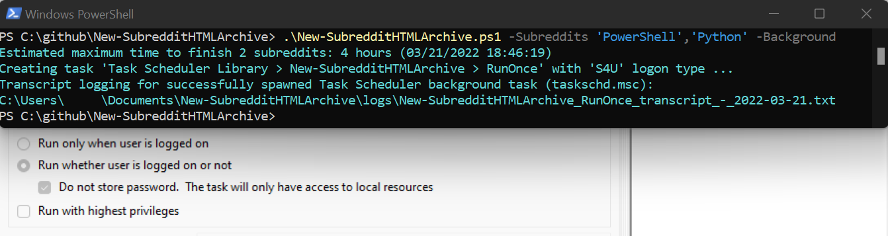

If you don't usually run scripts, I recommend you use the **Easy Setup Script** below, which does installation for you.  
  
Otherwise, you'll need to run [PowerShell](https://docs.microsoft.com/en-us/learn/modules/introduction-to-powershell/): WinKey+R, type **powershell**, hit Enter. Then in the taskbar along the screen bottom, right-click the blue icon with **>_** on it, and choose 'Run as Administrator'.  
Then at the console prompt (PS C:\Users\username>), type **Set-ExecutionPolicy Unrestricted**, hit Enter.  
Then type Y, and hit Enter to confirm. You can now close the second (Administrator titled) window.  
  
Then pick either GitHub or the PS Gallery option below to copy or install from.  
Both do the same thing, and you can copy/paste from this README into PowerShell.  
  
The suggested subreddit 'TestSubredditC' is a real subreddit name that takes just seconds to archive, and should be used as the default when installing packages on the first script run. The script is then expected to be supplied with a list of subreddit names, usually along with the -Background parameter, so you can lock your screen while the script continues to run.  
  
The Task Scheduler can be accessed by pressing the Windows key, typing the partial name 'Task S', then clicking 'Task Scheduler' when it pops up, or: press WinKey+R, type **taskschd.msc**, hit Enter.  
The new task can be renamed (via right-click > Export..., then Actions > Import Task...) and rescheduled to retrigger, archiving the same subreddits in the description monthly, etc. If the task name is unchanged, it will be overwritten when the script is run from the command line again, such as when you update the script. Note that if the running task is ended manually (right-click > End), you will need to manually kill the orphaned python process in Task Manager (CTRL+ALT+DEL), or simply reboot before retrying. For problems with the PS Gallery, remove the script first:  
PS> ($env:path).Split(';') | % {if (Test-Path "$\_\New-SubredditHTMLArchive.ps1"){start "$\_"}}  
  
The finished HTML archives and ZIP path are in the task description, and the end of the transcript.  
  
## Easy Setup Script: 
1) Click to open this link: https://raw.githubusercontent.com/mbarr564/New-SubredditHTMLArchive/main/setup.cmd  
2) Then once the link has opened in your browser, choose "File > Save Page As" (or CTRL+S), and choose your Desktop as the save location.  
3) From your Desktop (WinKey+D), right-click "setup.cmd" (that you just saved there), and click "Run as administrator", then approve prompts.  
  
## GitHub: Example Usage  
1) PS> Invoke-WebRequest -URI https://raw.githubusercontent.com/mbarr564/New-SubredditHTMLArchive/main/New-SubredditHTMLArchive.ps1 -OutFile .\New-SubredditHTMLArchive.ps1  
2) PS> .\New-SubredditHTMLArchive.ps1 -Subreddit 'TestSubredditC' -InstallPackages  
3) PS> .\New-SubredditHTMLArchive.ps1 -Subreddits 'AmateurRadio','HackRF','GNURadio' -Background  
  
## PowerShell Gallery: Install  
1) PS> Install-Script -Name New-SubredditHTMLArchive  
2) PS> New-SubredditHTMLArchive.ps1 -Subreddit 'TestSubredditC' -InstallPackages  
3) PS> New-SubredditHTMLArchive.ps1 -Subreddits (Get-Content "$($env:USERPROFILE)\Desktop\subs.txt")  
  
## PowerShell Gallery: Update  
1) PS> Update-Script -Name New-SubredditHTMLArchive  
2) PS> New-SubredditHTMLArchive.ps1 -Subreddits 'NetSec','NeuroScience','HomeLab' -Background  
  
## Comment Based Help (Script Header)  
1) PS> Set-ExecutionPolicy -ExecutionPolicy Unrestricted -Scope Process  
2) PS> Get-Content .\New-SubredditHTMLArchive.ps1 | Select -Skip 7 | Set-Content "$($env:temp)\temp.ps1"  
3) PS> Get-Help -Name "$($env:temp)\temp.ps1" -Full  
  
## Screenshots  
The script will run and make itself into a task called 'RunOnce' in Task Scheduler (taskschd.msc):  
  

  
Then seconds later, that created task will run, and by default will pop up an interactive console:  
  

  
If run with the -Background switch parameter, you will instead see the path to the transcript log:  
  

  
## Added features since initial release  
- Missing dependency package installation with the new -InstallPackages parameter.
    1. Outputs list of installed Python modules, and does prerequisite checks for winget.
- Support for arrays of subreddit names with the new -Subreddits parameter.
    1. Generates master index.html linking to all archived subreddit index files.
    2. Compresses master index and all HTML archive folders into a portable ZIP file.
- Assisted GitHub authentication step, progress bar, and subreddit input validation.
- Better BDFR-HTML module installation with error/standard output logging.
- BDFR clone operations are now retried up to 10 times, with cumulative sleep.
- Added logs folder and cleaned all folder management code.. all logs now retained.
- Added CTRL+C handling: once restarts clone, twice exits script. Added loop hang detection.
- Script spawns itself as a scheduled task, enabling background runs and rerun scheduling.
- Added -Background parameter to set spawned task LogonType to S4U (no stored password).
- PowerShell Gallery: https://www.powershellgallery.com/packages/New-SubredditHTMLArchive/
- Updated hang detection to not trigger if output JSON/media folder is growing by 1GB/4hrs.
- Checks BDFR logs for repeating errors from a submission ID, and excludes those IDs on retry.
- Now passes partial subreddit JSON clones to BDFR-HTML instead of terminating the script.
- Update 2.1.3: fixed to allow renamed/rescheduled monthly tasks to function as intended.
- Update 2.1.4: subreddits with large media downloads (in JSON folder) excluded from retries.

## Release 2.2 (May 2023)
- Added setup.cmd batch file, for further simplified first time setup and usage.
- Changed archived media size, to under 5MB, from under 2MB. Added -NoMediaPurge param.
- Removed GitHub CLI prereq completely. Script now uses only git.exe to clone repos.
- Tested with latest stable releases of BDFR (2.6.2), Python (3.11), and Git (2.40.1).
- New tools folder for prereq autoinstall location. Fixed winget install params.
